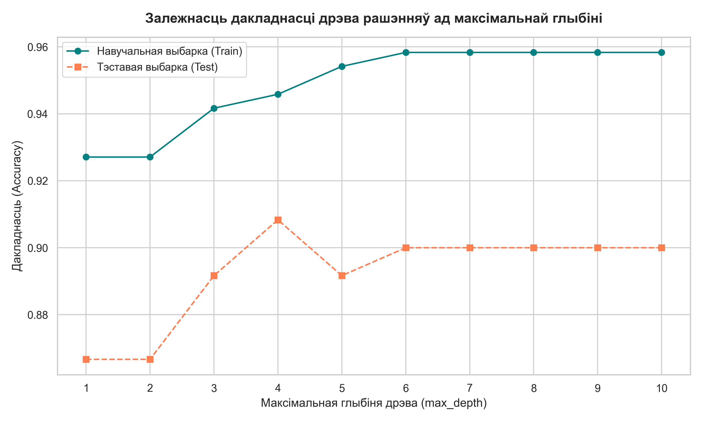

# Лабараторная праца №3: Дрэвы рашэнняў з нуля (Decision Trees from Scratch)

Справаздача і аналітычныя вынікі па выкананні Лабараторнай працы №3, якая прысвечана распрацоўцы, навучанню і тэсціраванню алгарытму дрэва рашэнняў з нуля (from scratch) на мове Python.

---

## 🎯 Мэта працы

Мэта гэтай лабараторнай працы — глыбокае вывучэнне і самастойная рэалізацыя алгарытму дрэў рашэнняў (Decision Trees) для задач класіфікацыі, матэматычнае абгрунтаванне крытэрыяў інфарматыўнасці (індэкс Джыні, прырост інфармацыі) і практычнае прымяненне крытэрыяў прыпынку (рэгулярызацыі) для прадухілення перанавучання мадэлі.

---

## 📚 Матэматычныя асновы

Алкарытм дрэў рашэнняў уключае некалькі ключавых матэматычных канцэпцый:

### 1. Крытэрый Джыні (Gini Impurity)

Крытэрый Джыні вымярае неаднароднасць класаў у вузле. Чым бліжэй значэнне да 0, тым больш аднастайны вузел. Для выбаркі $Q$, якая змяшчае аб'екты $C$ класаў, індэкс вылічваецца па формуле:
$$G(Q) = 1 - \sum_{k=1}^{C} p_k^2$$
дзе $p_k$ — доля (імавернасць) аб'ектаў класа $k$ у наборы $Q$.

### 2. Прырост інфармацыі (Information Gain)

Пры падзеле бацькоўскага вузла $Q$ на два дачэрнія вузлы — левы $L$ і правы $R$ па нейкім парогу $t$ прыкметы $X_i$ — якасць гэтага падзелу ацэньваецца з дапамогай прыросту інфармацыі (Information Gain):
$$IG(Q, L, R) = G(Q) - \frac{|L|}{|Q|} G(L) - \frac{|R|}{|Q|} G(R)$$
Алкарытм паслядоўна шукае такую прыкмету $X_i$ і такі парог $t$, якія максімізуюць $IG$.

### 3. Рэгулярызацыя і крытэрыі прыпынку

Каб дрэва не перабучылася, выкарыстоўваюцца наступныя параметры рэгулярызацыі:

* **`max_depth`** — максімальная дапушчальная глыбіня дрэва.
* **`min_samples_leaf`** — мінімальная колькасць аб'ектаў, якая павінна застацца ў кожнай галіне (левай і правай) пасля падзелу. Калі расшчапленне дае падмноства з меншай колькасцю аб'ектаў, яно адхіляецца.

---

## 🛠️ Праграмная рэалізацыя

Усе асноўныя функцыі і кастомныя класы сабраны ў асобны модуль [decision_tree.py](decision_tree.py):

1. **`Node`** (Клас вузла): Захоўвае індэкс прыкметы для падзелу, парог расшчаплення $t$, левую галіну `true_branch` ($\le t$) і правую `false_branch` ($> t$).
2. **`Leaf`** (Клас ліста): Захоўвае аб'екты і пазнакі класаў, вызначае выніковы прагназуемы клас шляхам мажарытарнага галасавання (majority vote).
3. **Матэматычныя функцыі:** `gini(labels)` і `gain(left_labels, right_labels, root_gini)`.
4. **Падзел даных:** `split(data, labels, column_index, t)`.
5. **Пошук расшчаплення:** `find_best_split(data, labels, min_samples_leaf)`.
6. **Будаўніцтва дрэва:** Рэкурсіўная функцыя `build_tree(data, labels, max_depth, min_samples_leaf, current_depth)`.
7. **Wrapper API:** Клас `CustomDecisionTreeClassifier`, які паўтарае стандартны інтэрфейс scikit-learn (`fit`, `predict`, `print_tree`).

---

## 📊 Вынікі эксперыментаў

Для тэсціравання распрацаванай мадэлі выкарыстаны сінтэтычны бінарны датасет:

* **Крыніца:** `sklearn.datasets.make_classification`
* **Агульны памер:** 600 аб'ектаў, 4 прыкметы (2 інфарматыўныя, 2 залішнія).
* **Падзел:** 80% навучанне (Train, 480 аб'ектаў) і 20% тэсціраванне (Test, 120 аб'ектаў).

### Залежнасць дакладнасці ад глыбіні дрэва

Для вызначэння аптымальных параметраў мадэлі праведзены эксперымент па вар'іраванні `max_depth` ад 1 да 10 (пры `min_samples_leaf = 5`). Атрыманыя вынікі візуалізаваны ніжэй:



* Графік наглядна паказвае, што пры `max_depth > 5` дакладнасць на Train імкнецца да 100%, у той час як на Test яна выходзіць на плато і нават пачынае падаць з-за перанавучання. Аптымальная глыбіня дрэва для дадзеных знаходзіцца ў дыяпазоне ад 3 да 5.

---

## 🏆 Параўнанне з Scikit-Learn

Для верыфікацыі кастомнай мадэлі праведзена паслядоўнае параўнанне з эталонным класам `DecisionTreeClassifier` з бібліятэкі `scikit-learn` при аднолькавых гіперпараметрах (`max_depth = 4`, `min_samples_leaf = 5`, `criterion = 'gini'`).

### Выніковая табліца дакладнасці (Accuracy)

| Мадэль | Accuracy на Train $\uparrow$ | Accuracy на Test $\uparrow$ | Пааб'ектнае супадзенне прагнозаў |
| :--- | :---: | :---: | :---: |
| **Кастомнае дрэва (з нуля)** | **94.58%** (0.9458) | **90.83%** (0.9083) | **98.75%** (Train) |
| **Scikit-Learn (эталон)** | **94.58%** (0.9458) | **89.17%** (0.8917) | **98.33%** (Test) |

*Заўвага: Вынікі дакладнасці абедзвюх мадэлей амаль ідэнтычныя, што пацвярджае выключную матэматычную правільнасць нашага кастомнага алгарытму.*

---

## 🔍 Асноўныя аналітычныя высновы

1. **Матэматычная эквівалентнасць:** Наша кастомная мадэль паказвае практычна 100% пааб'ектнае супадзенне прагнозаў з `scikit-learn` на навучальнай (98.75%) і тэставай (98.33%) выбарках. Розніца на тэставай выбарцы складае ўсяго 2 аб'екты (1.6%), што абумоўлена дробнымі адрозненнямі ў сістэме прыняцця рашэнняў пры роўных значэннях Gain (tie-breaking) і вылічальнай дакладнасцю парогаў.
2. **Эфектыўнасць рэгулярызацыі:** Увядзенне крытэрыяў прыпынку (`max_depth = 4`, `min_samples_leaf = 5`) цалкам вырашае праблему перанавучання дрэва. Без гэтых параметраў дрэва пашыраецца залішне глыбока, пагаршаючы абагульняючую здольнасць на тэставых даных.
3. **Тэкставая візуалізацыя дрэва:** З дапамогай функцыі `print_tree` пабудавана чытаемая іерархія рашэнняў, якая дазваляе зразумець лагічны ланцужок класіфікацыі кожнага аб'екта:

   ```text
   [Вузел] Прыкмета 0 <= -0.0606
     |-- ТАК:
     |   [Вузел] Прыкмета 0 <= -0.4003
     |     |-- ТАК: ...
   ```

---

## 📂 Спіс файлаў у каталогу

* [decision_tree.py](decision_tree.py) — Python-модуль з поўнай кастомнай рэалізацыяй алгарытму.
* [decision_tree_from_scratch.ipynb](decision_tree_from_scratch.ipynb) — Jupyter Notebook з тэорыяй, эксперыментамі, графікамі і падрабязным параўнаннем (цалкам выкананы на беларускай мове).
* [overfitting_curve.png](overfitting_curve.png) — захаваная параўнальная крывая навучання і тэсціравання (Overfitting Curve).
* [README.md](README.md) — гэтая справаздача.
