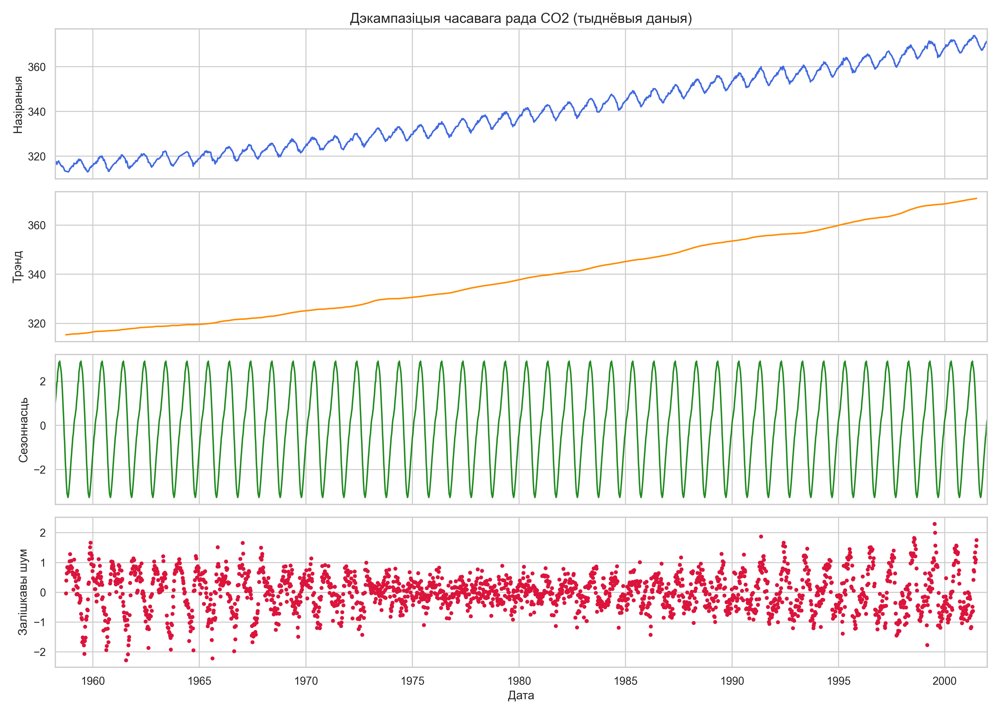
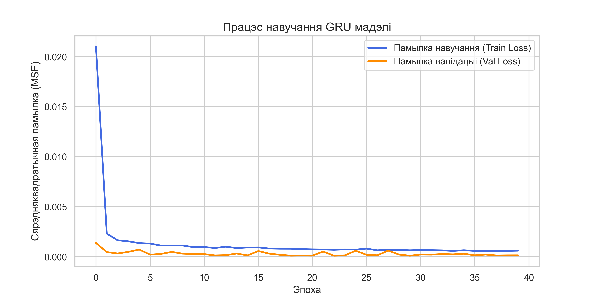
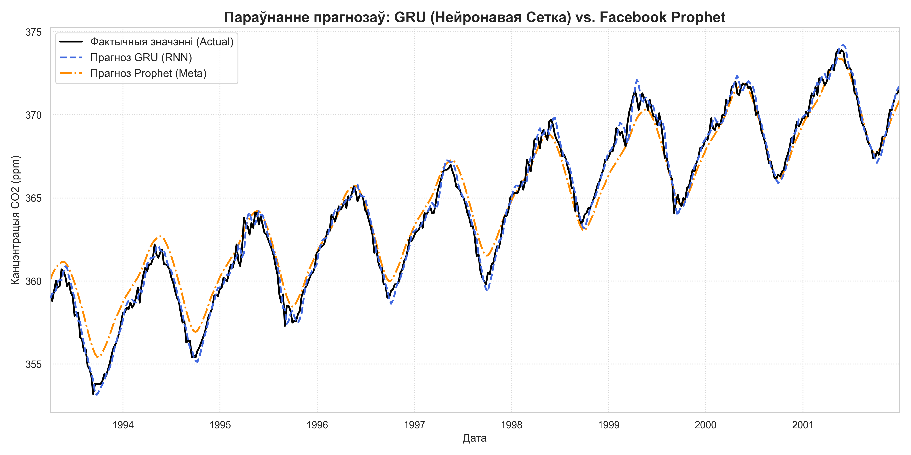

# Лабараторная праца №7: Прагназаванне часавых радаў з Prophet і RNN (GRU)

Гэты каталог утрымлівае поўную рэалізацыю Лабараторнай працы №7, прысвечанай параўнальнаму аналізу двух прынцыпова розных класаў мадэляў для прагназавання часавых радаў:

1. **Класічны адытыўны падыход:** Бібліятэка **Meta Prophet**, якая раскладае рад на гладкі трэнд, сезоннасць і каляндарныя эфекты.
2. **Нейрасецевы падыход (Глыбокае навучанне):** Рэкурэнтная нейронавая сетка на аснове **GRU (Gated Recurrent Unit)** з выкарыстаннем TensorFlow і Keras.

Усе матэрыялы лабараторнай працы, уключаючы каментарыі ў кодзе, тэкст справаздачы і надпісы на графіках, выкананы **выключна на беларускай мове**.

---

## 📊 1. Набор даных і разведвальны аналіз (EDA)

Для працы быў выбраны класічны часавы рад **CO2** (тыднёвыя вымярэнні канцэнтрацыі вуглякіслага газу ў атмасферы на абсерваторыі Маўна-Лоа, Гаваі) з бібліятэкі `statsmodels`.

### Асноўныя характарыстыкі даных

* **Агульны памер рада:** 2 284 тыднёвыя назіранні (з сакавіка 1958 года па снежань 2001 года).

* **Прапушчаныя значэнні (NaN):** Выяўлена 5 прапушчаных значэнняў. Яны былі запоўнены з дапамогай **лінейнай інтэрпаляцыі** для захавання цэласнасці паслядоўнасці.

### Сезонная дэкампазіцыя рада

Была выканана адытыўная дэкампазіцыя рада з перыядам $T=52$ тыдні (1 год). Гэта дазволіла наглядна выдзеліць наступныя складнікі:

* **Глабальны трэнд:** Дэманструе стабільны, амаль лінейны рост узроўню CO2 з цягам часу.
* **Сезоннасць:** Выяўляе выразныя, паўтаральныя штогадовыя ваганні з амплітудай каля $\pm 3$ ppm.
* **Залішкавы шум (Рэшта):** Мае выпадковы характар без выяўленых сістэматычных заканамернасцей.

### Праверка на стацыянарнасць (Тэст Дзікі-Фуллера)

Пашыраны тэст Дзікі-Фуллера (ADF test) быў прыменены для праверкі стацыянарнасці:

* **ADF-статыстыка:** `-0.0338`
* **p-value:** `0.9612` (значна больш за крытычны ўзровень 0.05)
* **Выснова:** Нулявая гіпотэза не адхіляецца. Часавы рад **не з'яўляецца стацыянарным** і валодае моцным узыходзячым трэндам.

---

## 🛠️ 2. Падрыхтоўка даных і падзел выбаркі

Даныя былі падзелены храналагічна на дзве часткі:

* **Навучальная выбарка (Train):** Першыя **80%** даных (1 827 назіранняў, 1958–1993 гг.).
* **Тэставая выбарка (Test):** Апошнія **20%** даных (457 назіранняў, 1993–2001 гг.).

### Падрыхтоўка для Meta Prophet

Фарматаванне ў датафрэйм з дзвюма калонкамі: `ds` (date) і `y` (target value).

### Падрыхтоўка для GRU Нейрасеткі

1. **Маштабаванне:** Нармалізацыя значэнняў у дыяпазон `[0, 1]` з дапамогай `MinMaxScaler` (навучаны выключна на Train выбарцы).
2. **Слізгальныя вокны:** Стварэнне навучальных паслядоўнасцей $X$ даўжынёй у **52 тыдні** (гістарычны кантэкст за 1 год) для прадказання значэння $y$ на 1 крок наперад.

---

## 🤖 3. Архітэктура і навучанне мадэляў

### А. Рэкурэнтная нейронавая сетка (GRU RNN)

* **Уваходны пласт:** `Input(shape=(52, 1))` (акно ў 52 тыдні, 1 прыкмета).
* **Рэкурэнтны пласт:** `GRU` (64 нейроны, функцыя актывацыі `tanh`, вяртае толькі апошні схаваны стан).
* **Рэгулярызацыя:** Пласт `Dropout(0.2)` для прадухілення перавучэння.
* **Выхадны пласт:** `Dense(1)` для лінейнага прагнозу аднаго значэння канцэнтрацыі CO2.
* **Кампіляцыя:** Аптымізатар `Adam`, функцыя памылкі `MSE` (Mean Squared Error).
* **Працэс навучання:** Навучанне праводзілася на працягу 50 эпох з выкарыстаннем `EarlyStopping` (пацыентнасць = 10 крокаў па валідацыйнай выбарцы) для адкату да лепшых вагаў.

### Б. Meta Prophet

Мадэль ініцыялізавана з улікам штогадовай сезоннасці (`yearly_seasonality=True`) і адключэннем дзённай і тыднёвай сезоннасці, паколькі часавы рад прадстаўлены асераднёнымі тыднёвымі данымі. Навучанне праводзілася па метадзе максімуму апастэрыёрнай ацэнкі (MAP).

---

## 📈 4. Вынікі параўнання і метрыкі якасці

Для абедзвюх мадэляў былі разлічаны метрыкі якасці на тэставым наборы даных (457 тыдняў). Прагнозы нейрасеткі былі вернуты ў зыходны маштаб (ppm CO2) перад разлікам метрык.

### Табліца параўнання метрык на тэставым перыядзе

| Метрыка | GRU (Нейронавая Сетка) | Facebook Prophet |
| :--- | :---: | :---: |
| **MAE (ppm)** | **0.3847** | 0.7057 |
| **RMSE (ppm)** | **0.4925** | 0.8664 |
| **MAPE (%)** | **0.1056%** | 0.1946% |

### Візуалізацыя прагнозаў на тэставым перыядзе

На графіку ніжэй прадстаўлена нагляднае параўнанне фактычных значэнняў CO2 з прагнозамі абедзвюх мадэляў.

---

## 🔍 5. Аналітычнае заключэнне

На аснове атрыманых вынікаў і дэталёвага аналізу прагнозаў можна зрабіць наступныя высновы:

### 1. Інтэрпрэтацыя эфектыўнасці мадэляў

* **GRU Нейрасетка** прадэманстравала найвышэйшую дакладнасць, паказаўшы памылку **MAE ~0.38 ppm** (MAPE ~0.10%). Мадэль выдатна адсочвае лакальныя ваганні і кароткатэрміновыя змены ў дынаміцы рада. Дзякуючы механізму слізгальнага акна даўжынёй у 52 тыдні, яна здольная адаптавацца да невялікіх змен трэнду непасрэдна перад крокам прагназавання.
* **Meta Prophet** паказаў крыху больш высокую памылку (**MAE ~0.70 ppm**), аднак яго прагноз з'яўляецца вельмі стабільным і гладкім. Prophet выдатна зафіксаваў агульны глабальны трэнд і ідэальна апрацаваў гадавую сезоннасць рада.

### 2. Рэкамендацыі па выбары мадэляў у вытворчасці

#### Калі выбіраць Facebook Prophet

1. **Хуткая распрацоўка і інтэрпрэтавальнасць:** Мадэль будуецца за секунды і раскладаецца на простыя складнікі (трэнд + сезоннасць), што лёгка патлумачыць бізнес-карыстальнікам.
2. **Складаны каляндар і святы:** Prophet мае ўбудаваны эфектыўны механізм для ўліку святочных дзён і спецыфічных падзей (напрыклад, Чорная пятніца).
3. **Няпоўныя або «брудныя» даны:** Мадэль устойлівая да пропускаў, не патрабуе складанага запаўнення NaNs і не адчувальная да лакальных анамалій (выкідаў).

#### Калі выбіраць Рэкурэнтныя Нейрасеткі (LSTM/GRU)

1. **Шматмерныя часавыя рады:** Калі для прагнозу патрабуецца выкарыстоўваць дзясяткі знешніх фактараў (надвор'е, цэны канкурэнтаў, маркетынгавыя кампаніі), нейрасеткі забяспечваюць максімальную гнуткасць.
2. **Кароткатэрміновае прагназаванне з высокай дакладнасцю:** Пры рабоце ў рэжыме «слізгальнага акна» на вялікіх аб'ёмах даных нейрасеткі здольныя аптымізаваць прагнозы да мінімальных памылак, адаптуючыся да кожнай лакальнай кропкі.
3. **Вялікія масівы даных:** На мільёнах радкоў даных Prophet становіцца павольным і абмежаваным, у той час як глыбокае навучанне цалкам раскрывае свой патэнцыял.
